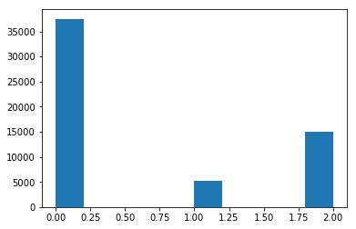
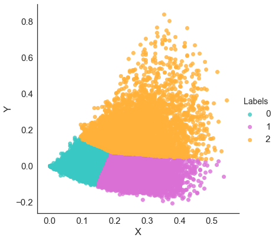

## Unsupervised Learning on Song Database

#### Objective : -
* To apply Unsupervised learning on a song database.
* Apply Latent Semantic Analysis to reduce dimension and to apply clustering on concepts.
* Find Best K value using 'Elbow' method.
* Measure performance of the model using inertia.
* Plot cluster in 2D for exploratory analysis

#### Q1: Load all data and vectorize it with tf-idf vectorization.


```python
import pandas as pd

df_song = pd.read_csv("songdata.csv")
```


```python
from sklearn.feature_extraction.text import TfidfVectorizer
import numpy as np

vect= TfidfVectorizer(min_df=5,stop_words = 'english')
X = vect.fit_transform(df_song.text)
X.shape
```


    (57650, 22557)


```python
from sklearn.cluster import KMeans

kmeans = KMeans(3)
clusters = kmeans.fit_predict(X)
clusters
```


    array([0, 2, 0, ..., 2, 0, 1])


```python
import matplotlib.pyplot as plt
%matplotlib inline

plt.hist(clusters)
```


    (array([ 37505.,      0.,      0.,      0.,      0.,   5217.,      0.,
                 0.,      0.,  14928.]),
     array([ 0. ,  0.2,  0.4,  0.6,  0.8,  1. ,  1.2,  1.4,  1.6,  1.8,  2. ]),
     <a list of 10 Patch objects>)





##### Analysis : - 
* Cluster 0 is having the most documents.
* Cluster 2 have the second highest number of documents and cluster 1 has the least.
* This infers that majority of the songs have similar features and they all have been clustered in cluster 0.

#### Q2: Apply a clustering algorithm with 3 clusters and find top 5 closest documents to each cluster’s centroid. Analyze your result.


```python
dist = kmeans.transform(X)
for i in range(dist.shape[1]):
    dist_np = np.array(dist[:,i])
    index = np.argsort(dist_np)[:5]
    print("Cluster: %d"%i,"\n\n",pd.concat([df_song.artist.iloc[index],df_song.text.iloc[index]],axis = 1),"\n")

```

    Cluster: 0 
    
                        artist                                               text
    4540                Drake  Know you've been hurt by someone else  \nI can...
    13907           New Order  Some people get up at the break of day  \nGott...
    27707  Christina Aguilera  Hey there boy did ya happen to know  \nWhereve...
    17260       Reba Mcentire  Another morning, another day in your life  \nW...
    26338        Bonnie Raitt  Told me baby  \nYou were just too tired to try... 
    
    Cluster: 1 
    
                   artist                                               text
    27550    Chris Brown  I know why you want love in the middle of the ...
    12310        Madonna  It's so hard to be someone,  \nIt's so hard to...
    19864             U2  I talk to you  \nYou walk away  \nYou're still...
    1175      Beach Boys  When you say you do  \nMakes me want to spend ...
    7060   Gloria Gaynor  Give you love, give you love  \nI'm gonna give... 
    
    Cluster: 2 
    
                    artist                                               text
    5342     Eric Clapton  You say you want everything good for me,  \nBu...
    33148       Freestyle  Baby baby baby  \nI've been lookin' at you loo...
    26445  Britney Spears  My friends say you're so into me  \nAnd that y...
    41875      Little Mix  (JADE)  \nDaddy doesn't think  \nThat you'll b...
    41818   Lionel Richie  I look at you  \nYou look at me  \n(You can't ... 
    
    

##### Analysis : -
* From Cluster 1, its observed that lyrics contain the frequently occuring word 'Love' implying that the songs with romance theme has been captured by this cluster.
* Other Clusters have all captured similar words used in different songs.

#### Q3: Reduce the dimension to 50 components using LSA and report top 5 features per component. Analyze your result.


```python
from sklearn.decomposition import TruncatedSVD

lsa = TruncatedSVD(50)
Z = lsa.fit_transform(X)

```


```python
print(Z.shape)
lsa.components_.shape
```

    (57650, 50)
    


    (50, 22557)


```python
words = np.array(vect.get_feature_names())
for i in range(Z.shape[1]):
    order = np.abs(lsa.components_[i]).argsort()[::-1]
    print(words[order[:5]])
```

    ['love' 'don' 'know' 'll' 'just']
    ['love' 'don' 'got' 'heart' 'gonna']
    ['oh' 'baby' 'yeah' 'll' 'time']
    ['oh' 'don' 'want' 'baby' 'know']
    ['baby' 'don' 'oh' 'want' 'know']
    ['ll' 'la' 'baby' 'got' 'yeah']
    ['la' 'll' 'got' 'baby' 'yeah']
    ['want' 'don' 'yeah' 'know' 've']
    ['yeah' 'll' 'let' 'gonna' 'want']
    ['let' 'll' 'want' 'don' 'yeah']
    ['got' 've' 'let' 'yeah' 'don']
    ['gonna' 'yeah' 've' 'know' 'oh']
    ['gonna' 'll' 'christmas' 'yeah' 'like']
    ['christmas' 'like' 'don' 'chorus' 'got']
    ['christmas' 'time' 'don' 'come' 'just']
    ['know' 'chorus' 'christmas' 'away' 'hey']
    ['come' 'know' 'hey' 'home' 'don']
    ['hey' 'like' 'say' 'girl' 'chorus']
    ['time' 'hey' 'heart' 'girl' 'chorus']
    ['chorus' 'know' 'come' 'wanna' 'man']
    ['time' 'say' 'girl' 'away' 'way']
    ['hey' 'girl' 'like' 'feel' 'little']
    ['chorus' 'need' 'wanna' 'life' 'hey']
    ['night' 'heart' 'come' 'tonight' 'like']
    ['wanna' 'need' 'time' 'feel' 'believe']
    ['away' 'say' 'night' 'tonight' 'need']
    ['girl' 'need' 'way' 'heart' 'chorus']
    ['home' 'need' 'wanna' 'long' 'just']
    ['just' 'way' 'heart' 've' 'feel']
    ['say' 'believe' 'like' 'just' 'girl']
    ['na' 'little' 'life' 'ooh' 'good']
    ['good' 'way' 'little' 'man' 'feel']
    ['believe' 'little' 'way' 'just' 'day']
    ['life' 'feel' 'little' 'believe' 'heart']
    ['believe' 'man' 'good' 'ain' 'tonight']
    ['man' 'home' 'day' 'tonight' 'just']
    ['little' 'man' 'life' 'tonight' 'woman']
    ['tell' 'make' 'little' 'right' 'away']
    ['tell' 'world' 'say' 'way' 'home']
    ['ooh' 'world' 'home' 'life' 'long']
    ['feel' 'tonight' 'good' 'night' 'tell']
    ['ooh' 'world' 'tonight' 'long' 'tell']
    ['ooh' 'feel' 'better' 'got' 'life']
    ['tell' 'gone' 'ain' 'make' 'feel']
    ['hold' 'dance' 'good' 'ooh' 'blue']
    ['hold' 'tonight' 'dance' 'make' 'day']
    ['better' 'ain' 'day' 'world' 'night']
    ['dance' 'forever' 'right' 'dream' 'think']
    ['rock' 'dance' 'roll' 'make' 'gotta']
    ['hold' 'long' 'rock' 'gone' 'make']
    

##### Analysis : -
* It's observed that some sets of words do capture some themes of the songs.
* From one of the components above its observed that 'Christmas' and 'Chorus' are together. This can be inferred that this component has captured the christmas theme of the song.
* 'Love' and 'heart' are captured together in another component telling us the romantic theme of the song.
* Most components have captured words such as 'tonight', 'hold', 'feel', 'good', 'love', 'baby' telling us that majority of the songs contains these words as highly occuring terms.

#### Q4: Run a clustering algorithm with 2-10 clusters on low dimension features and select the best number of clusters using elbow method.


```python
from sklearn.cluster import KMeans
inertia =[]

for i in range(2,11):
    kmeans_set = KMeans(i,max_iter=500)
    kmeans_set.fit(Z)
    inertia.append(kmeans_set.inertia_)

print(inertia)
```

    [7161.2548409876672, 6944.1218891019262, 6755.5705800236501, 6598.4246215378853, 6443.437545011293, 6388.3896084065718, 6211.6444135590937, 6101.0127531772887, 6008.7897017194482]
    


```python
f = plt.figure(figsize=(12,4))
f.add_subplot(1,2,1)
plt.xlabel("K Values")
plt.ylabel("Inertia")
plt.tight_layout()
plt.plot(range(2,11),inertia)

f.add_subplot(1,2,2)
plt.xlabel("K Values")
plt.ylabel("Inertia")
plt.tight_layout()
plt.plot(range(2,11),inertia)
plt.axvline(x=6,color="r")
```


    <matplotlib.lines.Line2D at 0x1a9c5097c88>


 * It's observed that the **optimal value of K is found to be 6** from the elbow method.

#### Q5: Use the best number of clusters that you have found and find top 5 closest documents to each cluster’s centroid. Compare your result with Q2


```python
from sklearn.cluster import KMeans
kmeans_new = KMeans(6,max_iter=500,n_init=5)
clusters_new = kmeans_new.fit_predict(Z)
clusters_new
```


    array([3, 2, 3, ..., 2, 3, 2])


```python
dist_new = kmeans_new.transform(Z)
for i in range(dist_new.shape[1]):
    dist_np_new = np.array(dist_new[:,i])
    index = np.argsort(dist_np_new)[:5]
    print("Cluster: %d"%i,"\n\n",pd.concat([df_song.artist[index],df_song.text.iloc[index]],axis=1),"\n")

```

    Cluster: 0 
    
                      artist                                               text
    26982       Cat Stevens  [Chorus]  \nLonger boats are coming to win us ...
    8345            Incubus  Woke up I wiped the sleepers from my eye  \nLo...
    32494      Fall Out Boy  [Originally by Jawbreaker]  \n  \nI have a pre...
    51587               Sia  You can be my alphabet  \nAnd I will be your c...
    43887  Michael W. Smith  Actions have been justified  \nAll is compromi... 
    
    Cluster: 1 
    
                   artist                                               text
    3014     Chuck Berry  Looks like I'll go on through my life bound in...
    17113  Rascal Flatts  Can't get enough of this everyday love  \nCan'...
    41959      LL Cool J  One shot  \nOh lord  \nYou know, it's gonna be...
    14487    Norah Jones  He takes me to the places you and I used to go...
    49214     Puff Daddy  I want her to feel it in her chest  \nI want h... 
    
    Cluster: 2 
    
                       artist                                               text
    21238  Weird Al Yankovic  As I walk through the valley where I harvest m...
    16404             Prince  You should never underestimate the power of  \...
    49449      Queen Latifah  My mellow Latee was kicking flavor  \nThe R.E....
    2618             Chicago  I guess I thought you'd be here forever  \nAno...
    32918        Frank Zappa  L. Ron Hoover:  \nWelcome to the First Church ... 
    
    Cluster: 3 
    
                        artist                                               text
    8546   Insane Clown Posse  The sun rises and sets on time every day of th...
    24200               Annie  Warbucks  \n  \nWhat is it about you  \nYou're...
    36207  Horrible Histories  Settle down, class  \nNow you've passed  \nYou...
    12052            Lou Reed  You're an adventurer  \nYou sail across the oc...
    37015  Insane Clown Posse  [Verse - Violent J]  \nI like to suffocate peo... 
    
    Cluster: 4 
    
                     artist                                               text
    22858      Ace Of Base  La la l'amour  \nGotta a lotta la la l'amour  ...
    19410        Tom Jones  There is a rose in Spanish Harlem  \nA red ros...
    27810  Christmas Songs  Hey! Chingedy ching,  \n(Hee-haw, hee-haw)  \n...
    43785  Michael Jackson  (with Carole Bayer Sager)  \n  \nYou and me  \...
    40373     King Diamond  As I look him deep in the eyes  \nI see only d... 
    
    Cluster: 5 
    
                          artist                                               text
    586    Allman Brothers Band  Oh-oh  \n  \nWalking in the midnight rain  \nT...
    44871          Natalie Cole  (Written by J. Livingston and R. Evans)  \nWe'...
    26691           Bryan White  Straight out of some story  \nYou walk in in a...
    36373            Ian Hunter  (mick, I've got a...)  \nThere must be one mil...
    49042                Prince  Oh daddy  \nOh, sock it to me  \n  \nSee my br... 
    
    

##### Analysis : -
* In Cluster 1 has captured words like 'Love' and 'feel', implying that this cluster is having songs with romantic theme.
* in Cluster 3, words relating to nature and adventure are captured. 
* Its also interesting to find that 3 songs of the same artist have been captured in the same cluster (Cluster 3).

#### Q6: Reduce dimension to 2 components and find 3 clusters in data and plot them using a scatter plot with different colors.  


```python
lsa2 = TruncatedSVD(2)
Z2 = lsa2.fit_transform(X)
Z2.shape
```


    (57650, 2)


```python
kmeans3 = KMeans(3)
kmeans_lsa = kmeans3.fit_predict(Z2)
```


```python
import seaborn as sns

#Set font size
sns.set(font_scale=1.5)
#set style of plots
sns.set_style('white')
#define a custom palette
customPalette = ['#39C8C3', 'orchid', '#FFB139']
sns.set_palette(customPalette)
```


```python
plot_df = pd.concat([pd.DataFrame(Z2,columns=["X","Y"]),pd.DataFrame(kmeans_lsa,columns=["Labels"])],axis=1)
facet = sns.lmplot(data=plot_df, x='X', y='Y', hue='Labels', 
                   fit_reg=False, legend=True, legend_out=True,size = 6)
```





##### Analysis : -
* It can be observed that cluster 2 is having the highest count. A few documents are seemed to be driffted away from the centeroid.
* Cluster 1 is having the second highest count of documents with slight dispersion.
* Cluster 0 has the lowest count of documents with no dispersion.
* These results matches our findings from the histogram plot of Q2.
* All 3 clusters are very close to each other. This infers that majority of the songs contain words that are occuring almost the same amount of time. Or in another words, all songs exhibit high similarity.

#### Conclusion : -
* Using LDA of 50 Components, the most frequent occuring words were identified and thus helped in infering the tone of most songs.
* Used Elbow method to find the optimum number of clusters.
* By analysing various clusters, songs of similar themes were observed to be in the same clusters.
